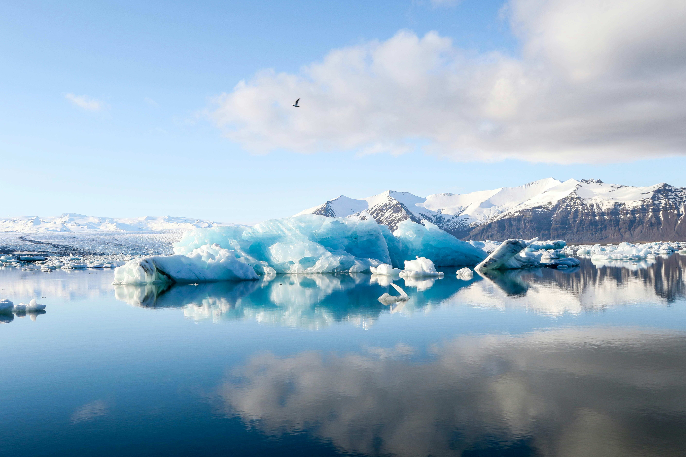

# PURE – Peak Performance Hydration Landing Page

A premium, modern, and high-performance landing page for **PURE**, a luxury bottled water brand. This project features a refined dark theme, responsive layout, and CSS-only animations.



## 🚀 Features

- **Modern Aesthetic**: A sleek, high-contrast dark theme inspired by flagship product pages.
- **Glassmorphism**: Elegant use of backdrop blur and semi-transparent layers on the navigation and content cards.
- **Cinematic Hero**: Features a tailored product entrance animation and dynamic typography.
- **Scroll Reveal**: Elements fade and slide into view automatically as you scroll—built entirely with pure CSS.
- **Responsive Design**: Fully optimized for mobile, tablet, and desktop displays.
- **Premium Content**: Detailed copy focusing on mineral precision, Arctic origin, and sustainable hydration.

## 🛠️ Technology Stack

- **Structure**: Semantic HTML5
- **Styling**: Vanilla CSS3
- **Animations**: CSS Keyframes & View-Timeline
- **Iconography**: Font Awesome 6.5
- **Typography**: Sora & Inter (Google Fonts)

## 📂 Project Structure

```text
├── assets/
│   ├── water-bottle.png    # Product Image
│   └── landscape.jpg       # Background Image
├── index.html              # Main HTML
└── style.css               # Project Styles
```
